<p align="center">
  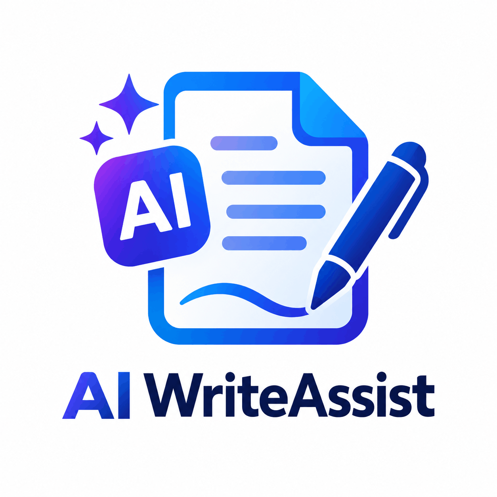
</p>

<h1 align="center">AI WriteAssist</h1>

<p align="center">
  A full-stack AI-powered application and formal letter assistant built with React, Supabase, and Gemini.
</p>

<p align="center">
  <a href="https://ai-application-letter-assistant.vercel.app/">Live Demo</a>
  ·
  <a href="https://github.com/kapilsarkar/AI-APPLICATION-LETTER-ASSISTANT">GitHub Repository</a>
</p>

---
## 📑 Table of Contents

- [Project Introduction](#project-introduction)
- [Live Demo & Repository](#-live-demo)
- [Project Overview](#-project-overview)
- [Key Features](#-key-features)
  - [Authentication](#-authentication)
  - [Guided Document Creation](#-guided-document-creation)
  - [AI Document Generation](#-ai-document-generation)
  - [Edit & Save](#️-edit--save)
  - [Dashboard](#-dashboard)
  - [Print / Save as PDF](#️-print--save-as-pdf)
- [Complete Project Walkthrough](#️-complete-project-walkthrough)
- [Screenshots](#-screenshots)
- [Application Flow](#-application-flow)
- [Architecture](#️-architecture)
- [Security](#-security)
- [Database Design](#️-database-design)
- [AI Generation Workflow](#-ai-generation-workflow)
- [Tech Stack](#-tech-stack)
- [Project Structure](#-project-structure)
- [Local Development](#️-local-development)
- [Deployment](#️-deployment)
- [Testing](#-testing)
- [Engineering Highlights](#-engineering-highlights)
- [Current Scope](#-current-scope)
- [Future Improvements](#-future-improvements)
- [What This Project Demonstrates](#-what-this-project-demonstrates)
- [Author](#-author)
- [Project-Status](#-project-status)

---

### Project Introduction

AI WriteAssist helps users create professional applications and formal letters through a guided workflow. Users authenticate securely, choose a document category and type, provide the required information, select language and tone, generate a document with Gemini AI, edit the generated content, save it, and print/save it as PDF through the browser.

🚀 Live Demo

- Live Application

[Live LINK](https://ai-application-letter-assistant.vercel.app/)

- Video Demo

[LIVE-DEMO]()

- GitHub Repository:

https://github.com/kapilsarkar/AI-APPLICATION-LETTER-ASSISTANT

📌 Project Overview

- AI WriteAssist was built as a practical full-stack application rather than a simple AI API demo.

### The project combines:

- Authentication and protected application access

- Guided, dynamic application forms

- Form validation

- Application CRUD operations

- User-specific database access with Row Level Security

- Secure server-side Gemini integration

- AI-generated professional documents

- Generated-document persistence

- Manual editing and saving

- Copy-to-clipboard

- Browser Print / Save as PDF

- Responsive application UI

- Production deployment with Vercel and Supabase

The main engineering goal was to keep the Gemini API key out of the browser and handle AI generation through a Supabase Edge Function.

### ✨ Key Features

### 🔐 Authentication

- User registration

- User login

- Protected application workflow

- Authenticated access to user data

- Supabase Auth integration

### 📝 Guided Document Creation

1. Choose a category

1. Choose a document type

1. Select language

1. Select tone

1. Fill in document-specific fields

1. Validate the submitted information

1. Review and generate the document

### 🤖 AI Document Generation

- Gemini-powered document generation

- AI generation through a Supabase Edge Function

- Gemini API key stored server-side

- Authenticated requests only

- Generated document returned to the application

- Generated content persisted separately from original form data

### ✏️ Edit & Save

- Users can review, edit, save, copy, and print generated documents.

### 📊 Dashboard

- The dashboard supports viewing, editing, renaming, and deleting saved applications.

### 🖨️ Print / Save as PDF

- The application provides a browser-based Print workflow that allows users to print the generated document or use the browser's Save as PDF option.

- This is a browser Print / Save as PDF workflow, not a custom PDF-generation engine.

## 🖼️ Complete Project Walkthrough

- The following visual overview shows the complete AI WriteAssist user journey — from authentication and guided application creation to AI document generation, editing, saving, and printing.

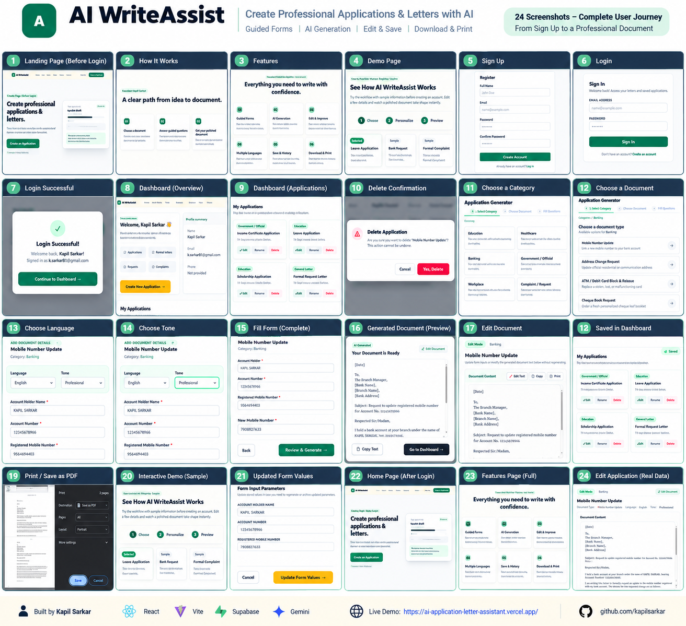

## 📸 Screenshots

A visual walkthrough of the AI WriteAssist application.

### Landing Page

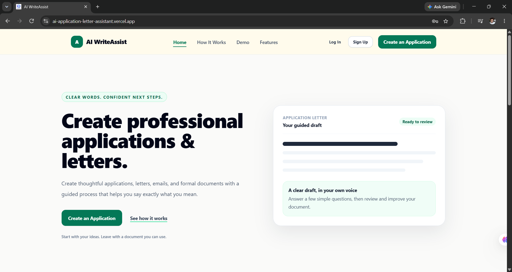

### Authentication

#### Login

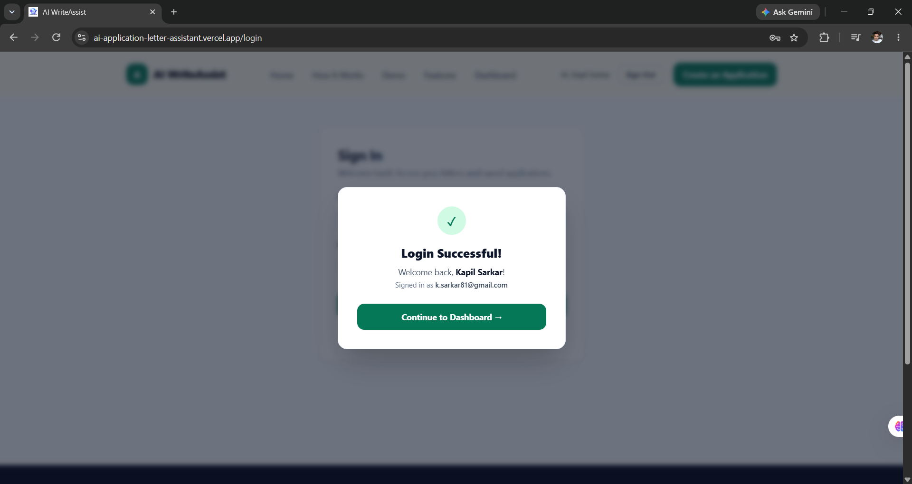

#### Register

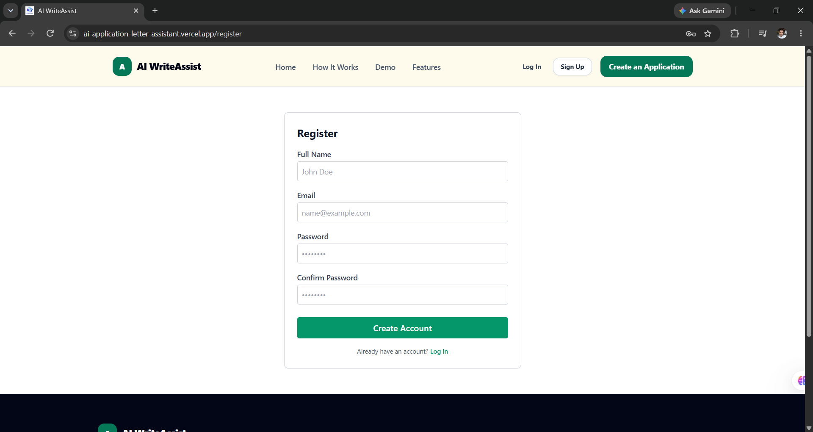

### Application Creation

#### Create Application

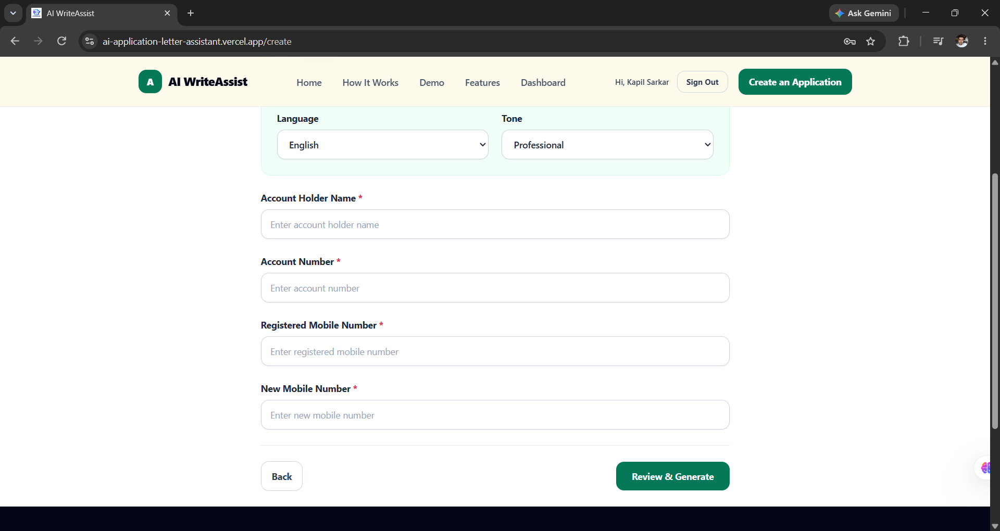

#### Choose Category

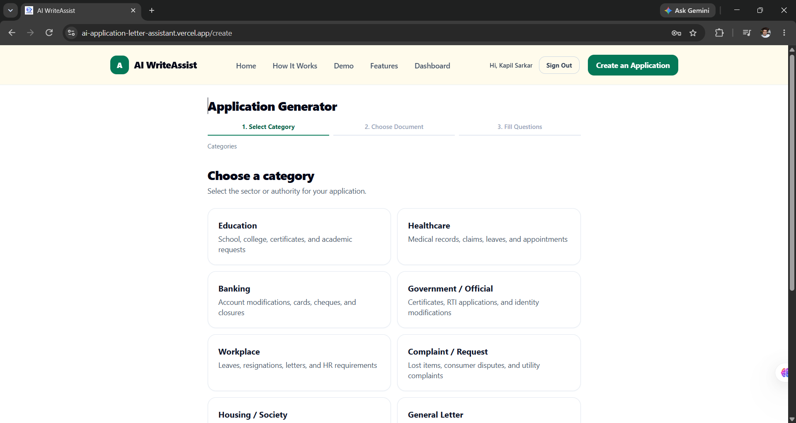

#### Choose Document

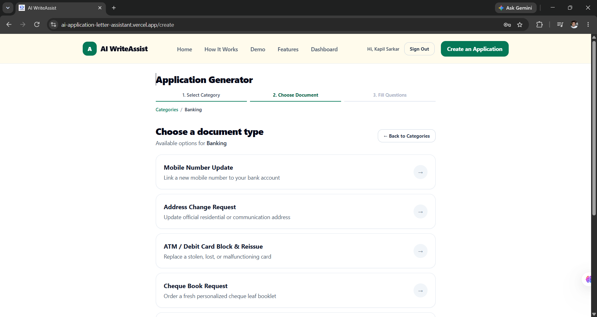

#### Choose Language

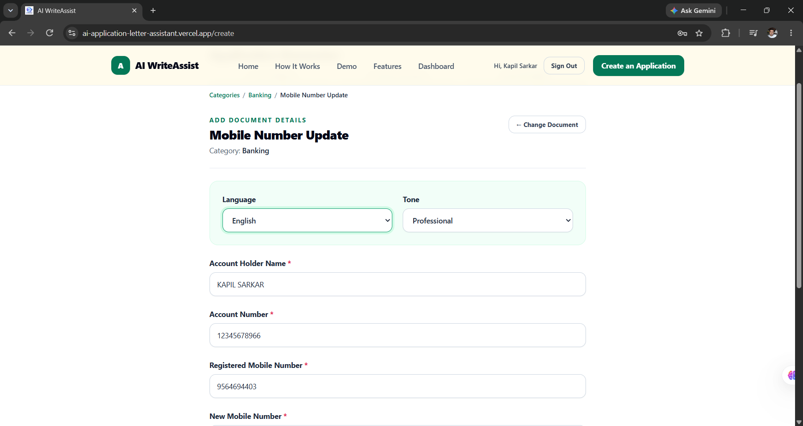

#### Choose Tone

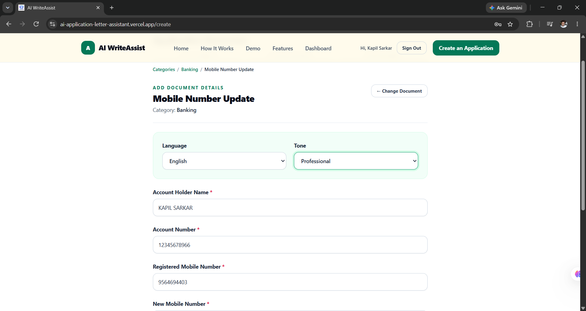

### AI Document Generation

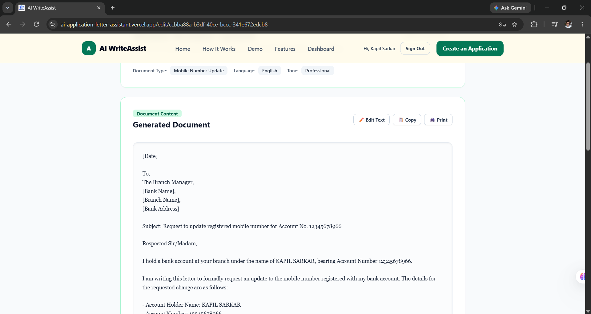

### Dashboard

#### Dashboard Overview

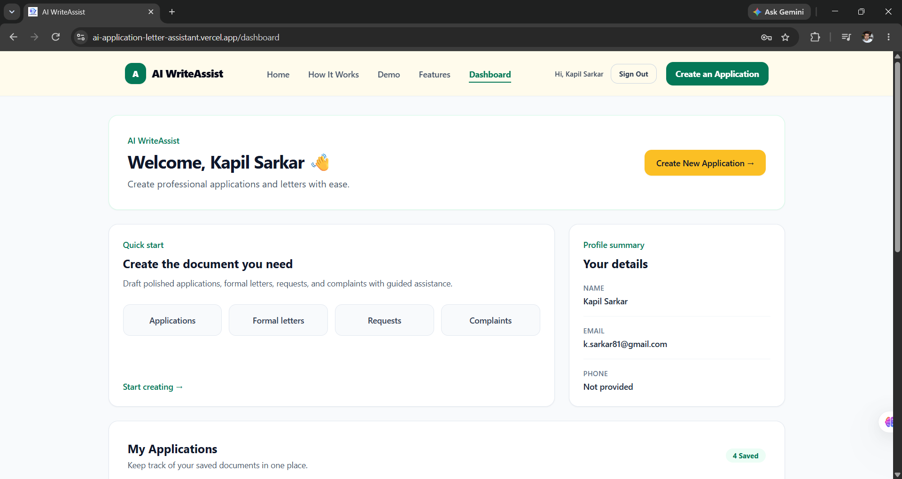

#### Dashboard Applications

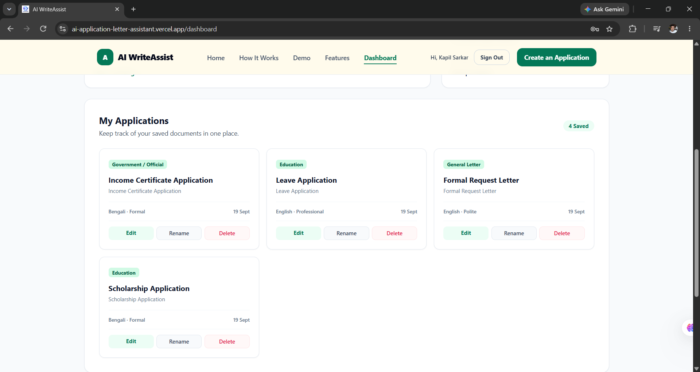

### Edit Application

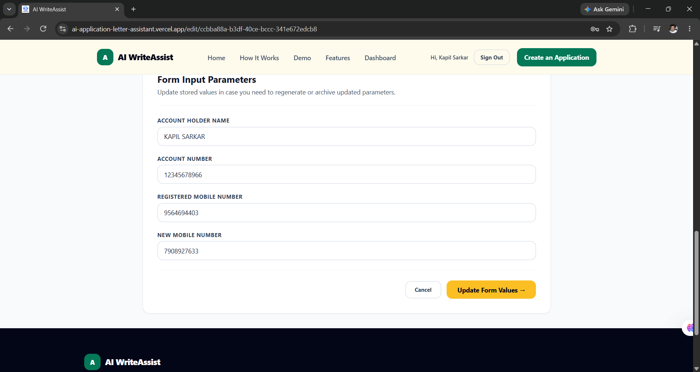

### Delete Application

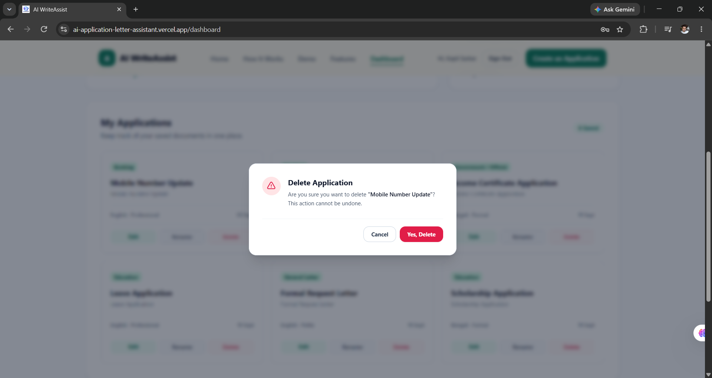

### Interactive Demo Preview

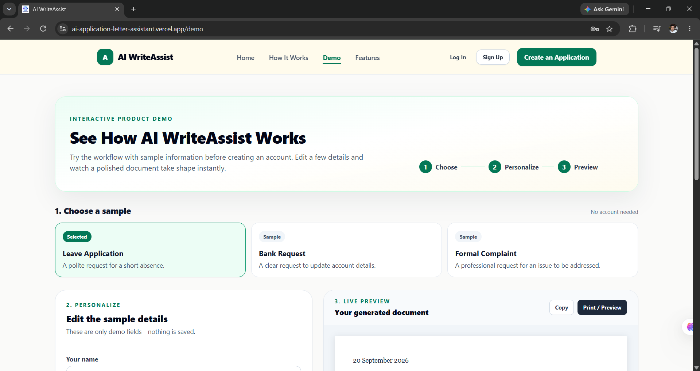

### Features

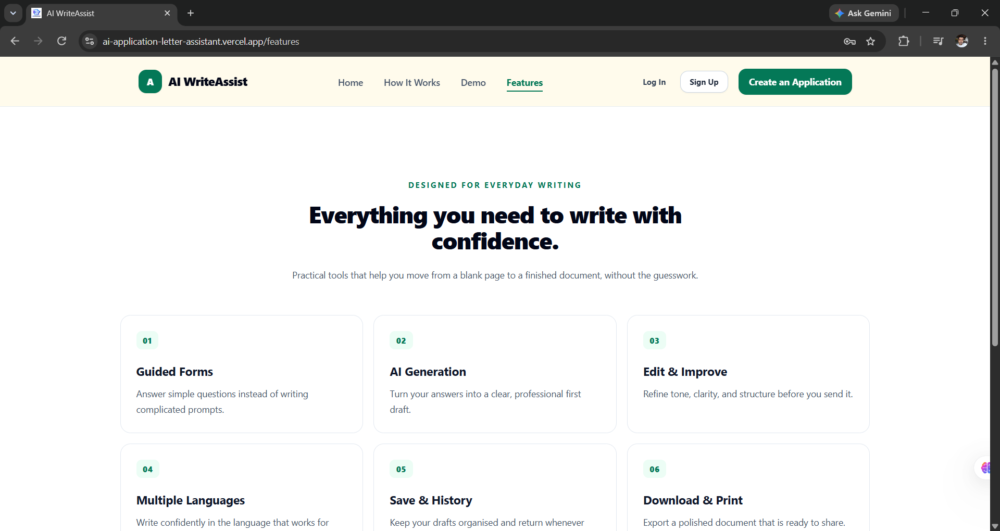

### 🧭 Application Flow

```text
User
 │
 ▼
Register / Login
 │
 ▼
Protected Application
 │
 ▼
Choose Category
 │
 ▼
Choose Document Type
 │
 ▼
Choose Language + Tone
 │
 ▼
Fill Dynamic Form
 │
 ▼
Validate Form Data
 │
 ▼
Save Application
 │
 ▼
Request AI Generation
 │
 ▼
Supabase Edge Function
 │
 ▼
Validate Authenticated User
 │
 ▼
Gemini AI
 │
 ▼
Generated Document
 │
 ├── Edit
 ├── Save
 ├── Copy
 └── Print / Save as PDF
 │
 ▼
Dashboard
```

### 🏗️ Architecture

```text
┌──────────────────────┐
                         │      User Browser     │
                         │    React + Vite App   │
                         └──────────┬───────────┘
                                    │
                 ┌──────────────────┴──────────────────┐
                 │                                     │
                 ▼                                     ▼
        ┌─────────────────┐                   ┌──────────────────┐
        │  Supabase Auth  │                   │ Application CRUD │
        └─────────────────┘                   └────────┬─────────┘
                                                       │
                                                       ▼
                                             ┌──────────────────┐
                                             │ Supabase Postgres │
                                             │      + RLS        │
                                             └──────────────────┘

                                    AI Generation
                                          │
                                          ▼
                              ┌──────────────────────┐
                              │ Supabase Edge        │
                              │ Function             │
                              │ generate-document    │
                              └──────────┬───────────┘
                                         │
                                         ▼
                              ┌──────────────────────┐
                              │      Gemini AI       │
                              └──────────┬───────────┘
                                         │
                                         ▼
                              Generated Document
```

### 🔐 Security

- The Gemini API key is stored as the Supabase Edge Function secret GEMINI_API_KEY and is not exposed through a frontend VITE_ variable.

- The Edge Function validates the authenticated user's bearer token before allowing document generation.

- Supabase Row Level Security restricts application data according to the authenticated user.

- Frontend configuration uses:

```text
VITE_SUPABASE_URL=your_supabase_project_url
VITE_SUPABASE_PUBLISHABLE_KEY=your_supabase_publishable_key

Never commit .env files or secret API keys to GitHub.
```

### 🗄️ Database Design

- The application stores structured form data separately from the generated document.

```js
applications


├── id

├── user_id

├── content

├── generated_document

└── other application metadata
```

- `content` : Stores the original structured application/form data.

- `generated_document` : Stores the generated or manually edited document as plain text.

- This separation keeps the original form data available for editing while allowing the generated document to be independently modified.

### 🤖 AI Generation Workflow

1. User completes the application form
          ↓
2. Form data is validated
          ↓
3. Application is saved
          ↓
4. User requests AI generation
          ↓
5. Frontend sends authenticated request
          ↓
6. Edge Function validates the user
          ↓
7. Edge Function reads GEMINI_API_KEY
          ↓
8. Gemini generates the document
          ↓
9. Generated document returned to React
          ↓
10. Generated document saved to database

- Saving the application before generation reduces the risk of losing completed form input when an AI request fails.

## 🧰 Tech Stack Tech Stack


| Technology | Purpose |
| :--- | :--- |
| **React 19** | Frontend UI |
| **Vite** | Development and production build tooling |
| **JavaScript** | Application language |
| **React Router** | Client-side routing |
| **Redux Toolkit** | Application state management |
| **React Hook Form** | Form handling |
| **Zod** | Form validation |
| **Tailwind CSS** | UI styling |
| **Supabase Auth** | Authentication |
| **Supabase PostgreSQL** | Database |
| **Supabase RLS** | Data access control |
| **Supabase Edge Functions** | Secure server-side AI integration |
| **Google Gemini** | AI document generation |
| **Vercel** | Frontend deployment |
| **Git / GitHub** | Version control |

## 📂 Project Structure

```text
AI-APPLICATION-LETTER-ASSISTANT/
.
│
├── public/
│   └── ICON/
├── src/
│   ├── components/
│   ├── pages/
│   ├── routes/
│   ├── services/
│   ├── store/
│   ├── hooks/
│   └── ...
├── supabase/
│   └── functions/
│       └── generate-document/
│           └── index.ts
├── docs/
│   └── screenshots/
├── .env
├── .gitignore
├── package.json
└── vite.config.js
```

### ⚙️ Local Development

1. Clone

```js
git clone https://github.com/kapilsarkar/AI-APPLICATION-LETTER-ASSISTANT.git
cd AI-APPLICATION-LETTER-ASSISTANT
```

2.Install

```js
npm install
```

3.Configure frontend environment variables

```js
Create .env:

VITE_SUPABASE_URL=your_supabase_project_url
VITE_SUPABASE_PUBLISHABLE_KEY=your_supabase_publishable_key

 Do not add the Gemini secret to the frontend.
```

4.Start development server

```js
npm run dev
```

5.Build

```js
npm run build
```

### ☁️ Deployment

```js
Frontend

The React/Vite application is deployed using Vercel.

Required frontend environment variables:

VITE_SUPABASE_URL
VITE_SUPABASE_PUBLISHABLE_KEY

Backend

Supabase provides:

Authentication

PostgreSQL

Row Level Security

Edge Functions

The Gemini API key is configured as a Supabase Edge Function secret.
```

### 🧪 Testing

The main flows were tested, including:

- Registration

- Login

- Protected access

- Application creation

- Dynamic form validation

- Application persistence

- AI document generation

- Generated document persistence

- Manual document editing

- Saving edited documents

- Dashboard operations

- Edit

- Rename

- Delete

- Browser Print / Save as PDF

- Production deployment

- Testing with a separate authenticated account

### 🧠 Engineering Highlights

1. Secure AI Integration

- AI generation is handled through a Supabase Edge Function rather than exposing the Gemini API key in the browser.

2. User-Owned Data

- Supabase Auth and Row Level Security protect application records.

3. Separation of Form Data and Generated Documents

- Original structured form content and generated document content are stored separately.

4. Dynamic Form Validation

- React Hook Form and Zod are used for structured user input and validation.

5. Save Before AI Generation

- The submitted application is saved before requesting AI generation, helping preserve the user's input if generation fails.

6. Manual Editing

- Generated documents can be edited and saved without requiring another AI generation request.


### 📈 Current Scope

- The current AI feature is intentionally focused on document generation.

#### The project currently supports:

- Guided application creation

- AI document generation

- Generated-document editing

- Saving generated documents

- Copy

- Browser Print / Save as PDF

AI rewrite, improvement, and translation are not part of the current implementation.


### 🔮 Future Improvements

- Dedicated PDF generation

- AI rewrite/improve workflow

- AI translation workflow

- More document categories and templates

- Improved document formatting

- Rate limiting for AI generation

- Usage/quota tracking

- Accessibility improvements

- Performance optimization and code splitting

### 💡 What This Project Demonstrates

#### This project demonstrates practical experience with:

- React application architecture

- JavaScript

- Client-side routing

- Form architecture

- Schema validation

- State management

- Authentication

- PostgreSQL

- Row Level Security

- CRUD operations

- Serverless backend functions

- Secure API integration

- Generative AI integration

- Error handling

- Data persistence

- Production deployment

- Git/GitHub workflow

## 👨‍💻 Author

 KAPIL-SARKAR.

- [LIVE-LINK](https://ai-application-letter-assistant.vercel.app/)

- [GITHUB-REPO](https://github.com/kapilsarkar/AI-APPLICATION-LETTER-ASSISTANT)

- [GITHUB](https://github.com/kapilsarkar)

- [LINKEDIN](https://www.linkedin.com/in/kapil-sarkar-439754249/)

- [X](https://x.com/kapil_cena1)

## 📄 Project Status

- This project is intended as a portfolio and demonstration project.